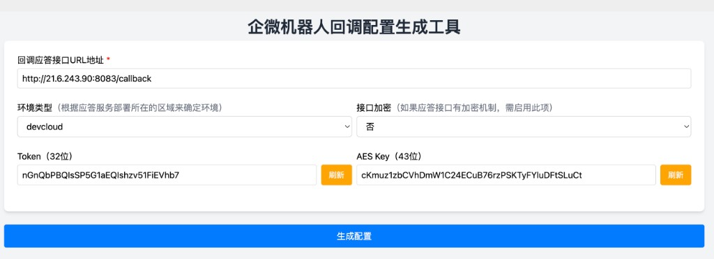
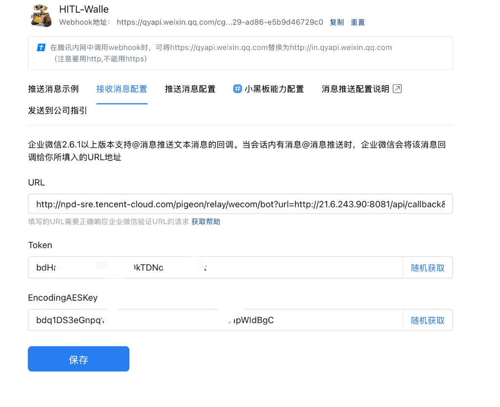

# 企业微信机器人接入指南

本文档指导你如何创建一个企业微信群机器人，并接入 AgentStudio Dispatch 平台，让它能够转发消息到你的 AI Agent。

## 前提条件

- 你有一个可用的 AI Agent 服务地址（支持 A2A 协议或 HTTP API）
- 你能访问腾讯内网（DevCloud 环境）

## 第一步：创建企业微信群机器人

在企业微信群中添加一个群机器人（如果你已有机器人可跳过此步）：

1. 打开企业微信，进入目标群聊
2. 点击群聊右上角 **设置** → **群机器人** → **添加机器人**
3. 为机器人取一个名字，完成创建
4. 创建后记录下机器人的 **Webhook 地址**，格式如：
   ```
   https://qyapi.weixin.qq.com/cgi-bin/webhook/send?key=xxxxxxxx-xxxx-xxxx-xxxx-xxxxxxxxxxxx
   ```

## 第二步：生成回调配置

企业微信的机器人回调需要经过 pigeon 中继服务转发。使用 pigeon 提供的配置生成工具来生成所需的回调参数。

1. 打开 pigeon 回调配置工具：

   **https://nops.woa.com/pigeon/v1/tools/webui#bot**

2. 按以下信息填写表单：

   | 字段 | 填写内容 |
   |------|---------|
   | **回调应答接口 URL 地址** | `http://21.6.243.90:8083/callback` |
   | **环境类型** | `devcloud` |
   | **接口加密** | `否` |

3. 点击 **Token** 和 **AES Key** 旁的 **刷新** 按钮，生成随机的 Token 和 AES Key

4. 点击底部的 **生成配置** 按钮

   

5. 页面会生成三个值，**请将它们复制保存**：
   - **URL**（一个包含 `pigeon/relay/wecom/bot?url=...` 的完整地址）
   - **Token**
   - **EncodingAESKey**

## 第三步：配置机器人接收消息

将上一步生成的配置填写到企业微信机器人的接收消息设置中：

1. 打开企业微信机器人管理页面（通常在群聊设置 → 群机器人 → 点击你的机器人）

2. 切换到 **接收消息配置** 标签页

3. 将第二步生成的三个值分别填入对应字段：

   | 字段 | 填写内容 |
   |------|---------|
   | **URL** | 第二步生成的完整 URL |
   | **Token** | 第二步生成的 Token |
   | **EncodingAESKey** | 第二步生成的 EncodingAESKey |

   

4. 点击 **保存**

   > 如果保存时提示错误，请检查 as-dispatch 服务是否正常运行（`http://21.6.243.90:8083` 需要能响应回调验证请求）。

## 第四步：注册 Bot 并开始使用

保存成功后，你的机器人就已经和 as-dispatch 平台连通了。接下来在群聊中完成注册：

1. 在群聊中 **@你的机器人** 发送任意消息（比如"你好"）

2. 机器人会回复一条 **注册引导消息**，提示你使用 `/register` 命令

3. 发送注册命令（@机器人）：

   ```
   /register <Bot名称> <你的Agent URL>
   ```

   示例：
   ```
   /register my-agent https://agentstudio.example.com/a2a/agent-id/messages
   ```

4. 注册成功后，机器人会确认：

   ```
   ✅ Bot 注册成功！
   • 名称: my-agent
   • 转发地址: https://agentstudio.example.com/a2a/agent-id/messages
   • 管理员: <你的企微ID>
   ```

5. 此后，所有发给这个机器人的消息都会自动转发到你指定的 Agent 地址

## 后续管理

注册完成后，你（作为 Bot 管理员）可以使用以下命令管理 Bot：

| 命令 | 说明 |
|------|------|
| `/bot info` | 查看 Bot 当前配置 |
| `/bot set url <新URL>` | 修改转发地址 |
| `/bot set name <新名称>` | 修改 Bot 名称 |
| `/bot set api-key <Key>` | 设置 API Key（如果 Agent 需要鉴权） |
| `/bot set timeout <秒>` | 修改请求超时时间（默认 60 秒） |

其他用户还可以使用项目管理命令配置自己的转发目标：

| 命令 | 说明 |
|------|------|
| `/ap <项目ID> <URL> --api-key <Key>` | 添加个人项目 |
| `/lp` | 查看我的项目列表 |
| `/u <项目ID>` | 切换使用的项目 |
| `/cp` | 查看当前使用的项目 |
| `/sess` | 查看会话列表 |
| `/reset` | 新建会话（重置对话上下文） |

## 常见问题

### 保存接收消息配置时报错

- 确认 as-dispatch 服务正在运行：访问 `http://21.6.243.90:8083/health` 检查
- 确认 pigeon 配置工具中的 URL 地址填写正确（`http://21.6.243.90:8083/callback`）
- 确认环境类型选择了 `devcloud`

### @机器人没有任何回复

- 确认「接收消息配置」已保存成功
- 检查是否在正确的群里 @了机器人
- 查看服务日志：`sudo journalctl -u as-dispatch -f`（在 pro 服务器上）

### /register 提示 Bot 已被注册

- 每个 Bot 只能被注册一次，第一个执行 `/register` 的用户成为管理员
- 如果需要更换管理员，请联系系统管理员在管理台操作

### 想让 Bot 转发到不同的 Agent

- Bot 管理员使用 `/bot set url <新URL>` 修改默认转发地址
- 其他用户可以使用 `/ap <项目ID> <URL>` 添加自己的项目配置，实现不同用户转发到不同的 Agent
